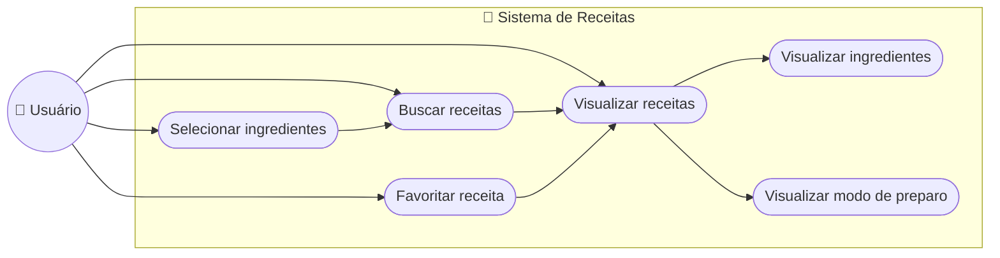

# 🥞 CentralComida

## 📖 Sobre o Projeto

Um site de receitas para qualquer tipo de fome, da comunidade, para comunidade.

Uma ajuda as pessoas a encontrarem receitas mais rápido, com possibilidade de selecionar quais ingredientes você possui e encontrar o que fazer com esses ingredientes.
Com você podendo ajudar a crescer as receitas disponíveis no site.

---

## 🎯 Objetivo
O principal objetivo do projeto é facilitar a descoberta de receitas a partir dos ingredientes que o usuário já possui, tornando o processo de decidir o que cozinhar mais rápido e prático.

Além disso, o projeto pode contribuir para:

* Reduzir o desperdício de alimentos.
* Aproveitar melhor os ingredientes disponíveis.
* Economizar tempo na busca por receitas.
* Incentivar as pessoas a cozinhar em casa.

## ✨ Funcionalidades

* 🔎 Buscar receitas de forma rápida.
* 🥕 Selecionar os ingredientes disponíveis.
* 🍽️ Encontrar receitas com base nos ingredientes selecionados.
* 📋 Visualizar os ingredientes necessários para cada receita.
* 👨‍🍳 Consultar o modo de preparo das receitas.
* ⭐ Possibilidade de favoritar receitas.
* 📱 Interface simples e intuitiva.

---

## ⚙️ Funcionalidades Principais

O fluxo principal da aplicação é simples:

O usuário acessa a aplicação.

Seleciona os ingredientes que possui.

A aplicação analisa as receitas disponíveis.

São apresentadas receitas que podem ser preparadas com os ingredientes selecionados.

O usuário escolhe uma receita.

A aplicação apresenta os ingredientes e o modo de preparo.

---

## Diagramas de sequência e de caso de uso

---

## 🛠️ Tecnologias

### **Frontend**

### **Backend**

### **Banco de Dados**

### **API**

---

## 🗓️ Roadmap do MVP

- [ ] **Milestone 1: Alinhamento, Design e Base do Projeto**  
  * Protótipo no Figma, setup da estrutura Expo/Node.js, modelagem do PostgreSQL e criação do conteúdo inicial.
- [ ] **Milestone 2: Núcleo do Aplicativo**  
  * Login com Firebase, mapa de fases e motor visual dos 3 tipos de exercícios.
- [ ] **Milestone 3: Gamificação e Sandbox Python**  
  * Contador de Streaks, barra de progresso e integração do Pyodide (WASM) para execução de código.
- [ ] **Milestone 4: Tutor IA**  
  * Engenharia de prompts e integração da LLM para suporte dinâmico no player de exercícios.
- [ ] **Milestone 5: Testes e Lançamento**  
  * Correções de bugs, polimento de UI/UX, deploy da infraestrutura e publicação da versão de teste.
---
## Metodologia

**Kanban** : asdasdadasd12124234234234242
---

## 👥 Equipe

João Vítor Maia
