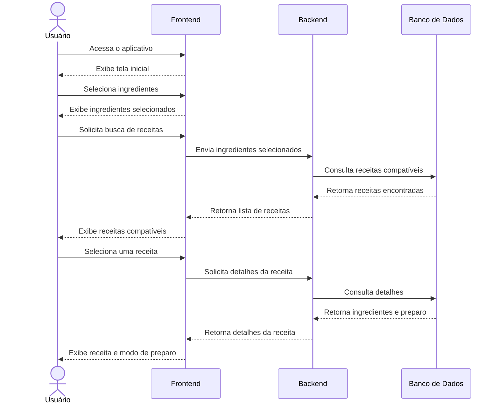

# 🥞 Central Comida
<!-- direitos trans sao direitos humanos 🏳️‍⚧️ -->

## 📖 Sobre o Projeto

Um site de receitas para qualquer tipo de fome, da comunidade, para comunidade.

Uma ajuda as pessoas a encontrarem receitas mais rápido, com possibilidade de selecionar quais ingredientes você possui e encontrar o que fazer com esses ingredientes.
Com você podendo ajudar a crescer as receitas disponíveis no site.

---

## 🎯 Objetivo
O principal objetivo do projeto é facilitar a descoberta de receitas a partir dos ingredientes que o usuário já possui, tornando o processo de decidir o que cozinhar mais rápido e prático.

Além disso, o projeto pode contribuir para:

* Reduzir o desperdício de alimentos.
* Aproveitar melhor os ingredientes disponíveis.
* Economizar tempo na busca por receitas.
* Incentivar as pessoas a cozinhar em casa.

## ✨ Funcionalidades

* 🍽️ Encontrar receitas com base nos ingredientes selecionados.
* 📋 Visualizar os ingredientes necessários para cada receita.
* 👨‍🍳 Consultar o modo de preparo das receitas.
* 🥕 Selecionar os ingredientes disponíveis.
* ⭐ Possibilidade de favoritar receitas.
* 🔎 Buscar receitas de forma rápida.
* ↔️ Substituição de ingredientes para maior liberdade criativa.
* 📱 Interface simples e intuitiva.

---

## Diagramas de sequência e de caso de uso

---

---
## 🌐Interfaces

(interfaces ainda em andamento)

---

## 🛠️ Tecnologias

### **Frontend**

### **Backend**

### **Banco de Dados**

### **API**

---

## 🗓️ Roadmap do MVP

- [ ] **1: Alinhamento, Design e Base do Projeto**  
  * Definição dos requisitos, criação do protótipo no Figma, estruturação do projeto, modelagem do banco de dados e cadastro do conteúdo inicial de receitas e ingredientes.
- [ ] **2: Núcleo do Aplicativo**  
  * Desenvolvimento da tela inicial, catálogo de ingredientes, seleção dos ingredientes disponíveis e implementação do sistema de busca e filtragem de receitas.
- [ ] **3: Sistema de Receitas**  
  * Implementação da exibição das receitas encontradas, detalhes dos ingredientes necessários, modo de preparo, tempo de preparo e indicação de compatibilidade com os ingredientes selecionados.
- [ ] **4: Experiência do Usuário**  
  * Implementação de favoritos, filtros por categorias e melhorias na navegação, além de ajustes de UI/UX para tornar a descoberta de receitas mais rápida e intuitiva.
- [ ] **5: Testes e Lançamento do MVP**  
  * Realização de testes funcionais, correção de bugs, validação do fluxo principal, polimento da interface, documentação e publicação da primeira versão do sistema.
---
## Metodologia

* **Kanban**
  : Pela facilidade de compreender as adições necessárias ao site.
* **Espiral**
  : Pela eficácia de resolver problemas já existentes no projeto.
---

## 👥 Equipe

João Vítor Maia
