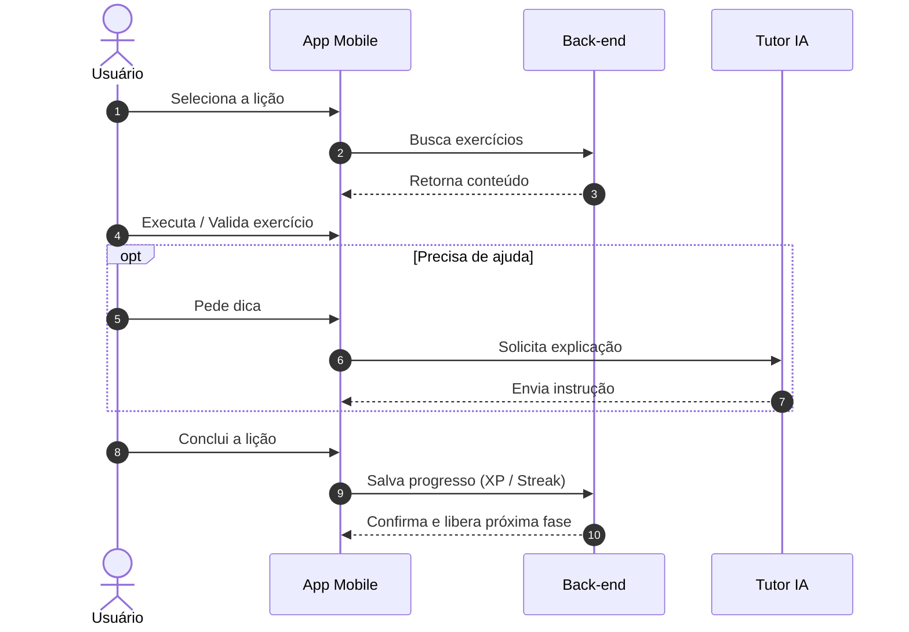
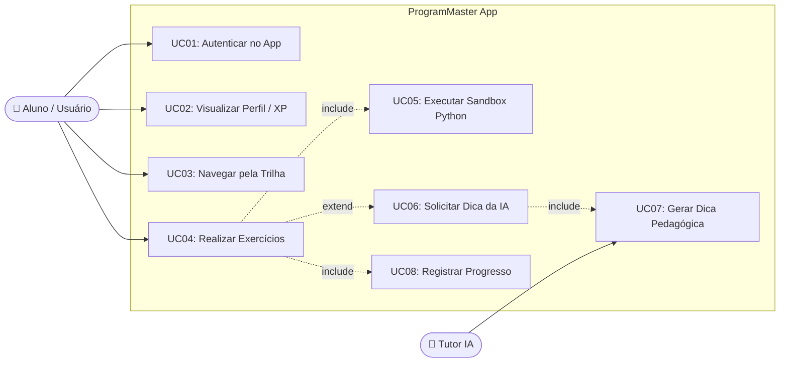

# 🚀 ProgramMaster — Plataforma de Aprendizagem em Programação

## 📖 Sobre o Projeto

Este projeto tem como objetivo desenvolver uma **plataforma interativa de aprendizagem de programação**, criada para auxiliar principalmente pessoas que estão iniciando sua jornada no desenvolvimento de software.

A plataforma busca transformar o aprendizado de programação em uma experiência mais **dinâmica, prática e envolvente**, combinando conteúdos educacionais, exercícios e elementos de gamificação.

---

## 🎯 Objetivo

O principal objetivo do projeto é **facilitar o aprendizado de programação para iniciantes**, proporcionando uma experiência que estimule a prática constante e mantenha o usuário motivado durante sua evolução.

A plataforma pretende:

* 🧑‍💻 Auxiliar pessoas que estão começando a programar;
* 📚 Apresentar conteúdos de forma progressiva;
* 🧩 Propor exercícios e desafios práticos;
* 📈 Permitir que o usuário acompanhe sua evolução;
* 🔥 Estimular a criação de uma rotina de estudos;
* 🏆 Criar metas, conquistas e recompensas;
* ⚡ Tornar o processo de aprendizagem mais dinâmico;

---

## 📊 Pesquisa e Validação (Data-Driven)

Esta seção resume a pesquisa de mercado e o feedback dos usuários reais coletados na Google Play Store (amostra de 1.472 avaliações, filtradas de 10.000 avaliações).

### Palavras Chave

### Resultado

### Pontos Negativos
- 40%+ das críticas focam na restrição excessiva do plano gratuito.
- Superficial e repetitivo para quem quer profundidade.

### Pontos Positivos
- Excelente para iniciantes absolutos.
- Boa UI/UX.

Link para pesquisa:
https://github.com/1Soryuu/ProgramMaster/blob/main/PI/Design/Pesquisa/sugestoes_mimo_10000.csv

---

## ⚙️ Funcionalidades Principais

### 1. Autenticação e Perfil Simples
* **Autenticação Segura:** Cadastro e login via OAuth (Google, Apple, etc.).
* **Perfil de Usuário:** Armazenamento do progresso individual diretamente na nuvem.

### 2. Trilha de Aprendizagem Linear
* **Conteúdo Estruturado:** Curso focado nos fundamentos de Python.
* **Mapa de Fases:** Interface gamificada com desbloqueio sequencial de aulas à medida que o aluno avança.
* **Lições em Pílulas (Cards):** Telas curtas com explicações objetivas e diretas, dividindo o conteúdo em micro-etapas de fácil assimilação.

### 3. Motor de Lições e Exercícios Interativos
* **Formatos de Exercícios:**
  * Múltipla escolha.
  * Ordenação de blocos de código/palavras.
  * Preenchimento de lacunas (*fill-in-the-blank*).
* **Feedback Imediato:** Retorno instantâneo de acerto ou erro com explicações curtas.

### 4. Mecânica Básica de Retenção (Gamificação)
* **Contador de Ofensiva (Streak):** Monitoramento de dias consecutivos de estudo para construção de hábitos.
* **Progresso Visual:** Barras de progresso claras por módulo e recompensas visuais ao finalizar cada lição.

---

## Diagramas de sequência e de caso de uso

---

## 🎨 Diretrizes de UI/UX e Gamificação

### 1. Interface de Usuário (UI) e Ergonomia Visual
* **Protagonismo do Código:** A área de código/exercício é o elemento principal da tela, enquanto botões e instruções secundárias são diferenciados por cor e peso.
* **Minimalismo Funcional:** Design limpo e sem distrações visuais desnecessárias para evitar o cansaço mental.
* **Feedback Instantâneo:** Respostas visuais imediatas para ações do usuário (hover em botões, telas de carregamento e avisos de erro/sucesso).

### 2. Retenção de Atenção e UX de Engajamento
* **Onboarding sem Atrito:** Acesso rápido ao valor do app antes de cadastros burocráticos para evitar o abandono inicial.
* **Estado de Fluxo (Flow):** Progressão de dificuldade balanceada para manter o usuário engajado, evitando tédio ou frustração.
* **Microlearning:** Explicações teóricas divididas em blocos curtos, práticos e diretos ao ponto.
* **Lembretes Personalizados:** Notificações focadas na evolução e no progresso real do aluno.

A intenção é criar um ambiente no qual o usuário consiga **visualizar sua evolução e estabelecer objetivos**, tornando o aprendizado mais estimulante.

---

## 📚 Estrutura de Aprendizagem

O conteúdo será organizado de maneira progressiva, começando pelos conceitos fundamentais e avançando gradualmente para assuntos mais complexos.

### 🟢 Nível Iniciante

* Variáveis;
* Tipos de dados;
* Operadores;
* Condicionais;
* Estruturas de repetição;
* Funções.

### 🟡 Nível Intermediário

* Estruturas de dados (Listas, Tuplas, Dicionários e Conjuntos);
* Manipulação de arquivos;
* * Tratamento de erros;
* Programação orientada a objetos;
* Modularização;
* Bibliotecas.

### 🔴 Nível Avançado

* Estruturas de dados avançadas;
* Arquitetura de software;
* Padrões de projeto;
* APIs;
* Banco de dados;
* Desenvolvimento de projetos.

---

## 🛠️ Tecnologias

### **Front-end & Mobile**

**React Native + Expo:** Simplificam a navegação além de permitirem a reutilização do código Web no mobile.

**JS / TS + React:** Transição suave do React (Web) para o React Native. TypeScript ajuda a evitar erros comuns de digitação em estruturas JSON.

### **Back-end & Infraestrutura**

**Pyodide + WebAssembly:** Pyodide permite executar o código Python diretamente no dispositivo do usuário via WebAssembly. Isso reduz o custo de servidor a quase zero e elimina riscos de segurança no Back-end.

**Node.js:** Orquestra as APIs REST de navegação, entrega as lições e chamadas para a LLM (Tutor IA).

**PostgreSQL:** Banco relacional sólido para salvar o progresso das lições, e as ofensivas (streaks).

---

## 🗓️ Roadmap do MVP

- [ ] **Milestone 1: Alinhamento, Design e Base do Projeto**  
  * Protótipo no Figma, setup da estrutura Expo/Node.js, modelagem do PostgreSQL e criação do conteúdo inicial.
- [ ] **Milestone 2: Núcleo do Aplicativo**  
  * Login com Firebase, mapa de fases e motor visual dos 3 tipos de exercícios.
- [ ] **Milestone 3: Gamificação e Sandbox Python**  
  * Contador de Streaks, barra de progresso e integração do Pyodide (WASM) para execução de código.
- [ ] **Milestone 4: Tutor IA**  
  * Engenharia de prompts e integração da LLM para suporte dinâmico no player de exercícios.
- [ ] **Milestone 5: Testes e Lançamento**  
  * Correções de bugs, polimento de UI/UX, deploy da infraestrutura e publicação da versão de teste.
  
---

## 👥 Equipe

| Integrante                       | Função    |
| -------------------------------- | --------- |
| Victor Yamada Miyashiro          | Frontend  |
| Guilherme Gotardo Santana        | Backend   |
| Pedro Vieira Lima                | UI/UX     |
| Matheus Vinicius da Silva Marigo | Backend   |
| João Vitor Maia                  | Conteúdo  |
| Bruno Henrique Viana de Souza    | Backend   |
